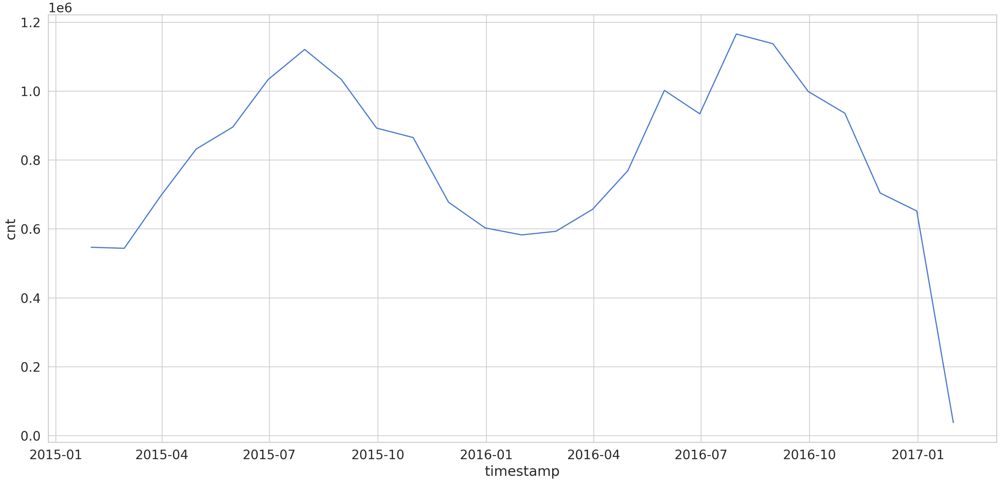
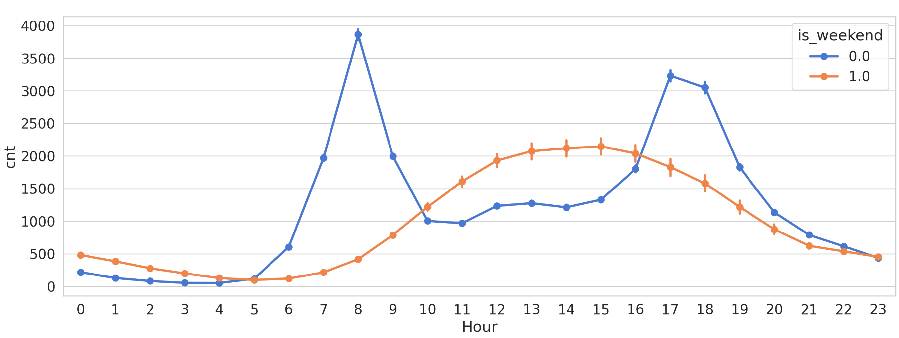
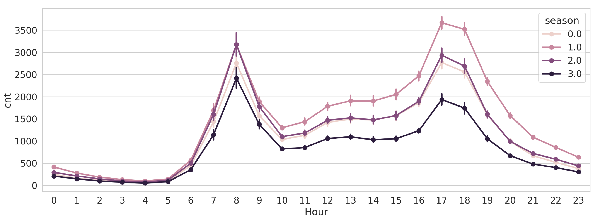
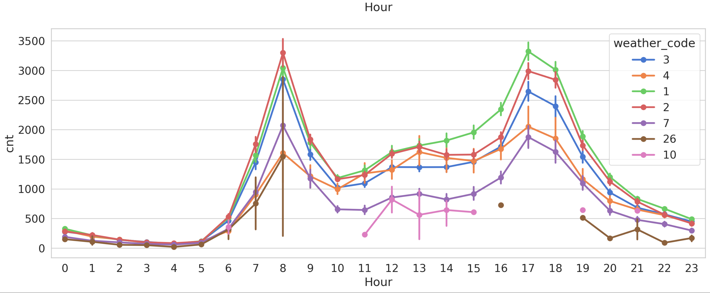
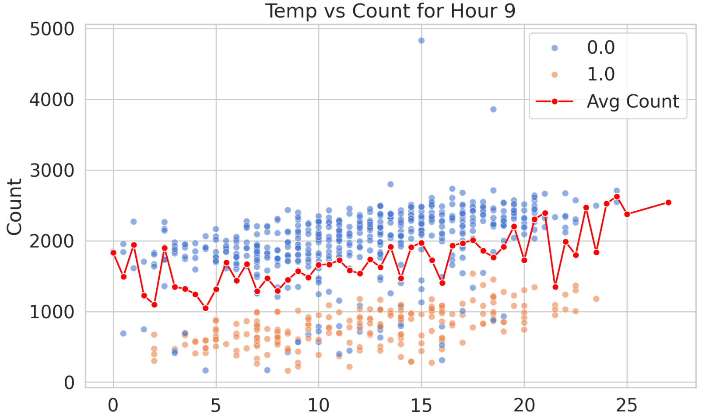
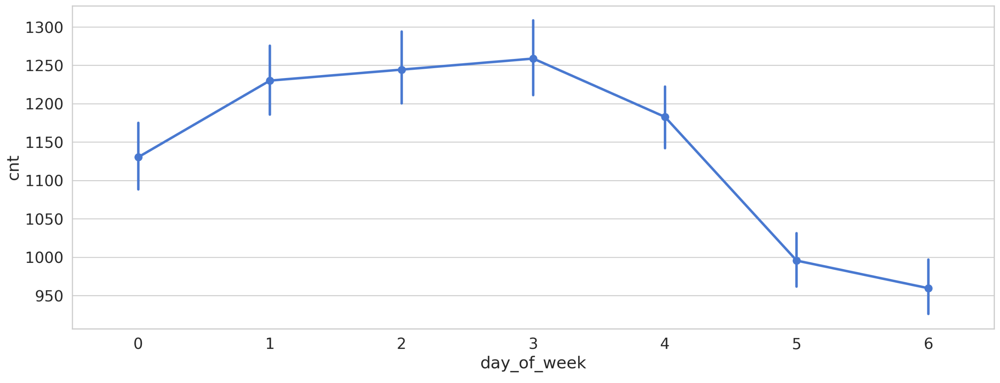
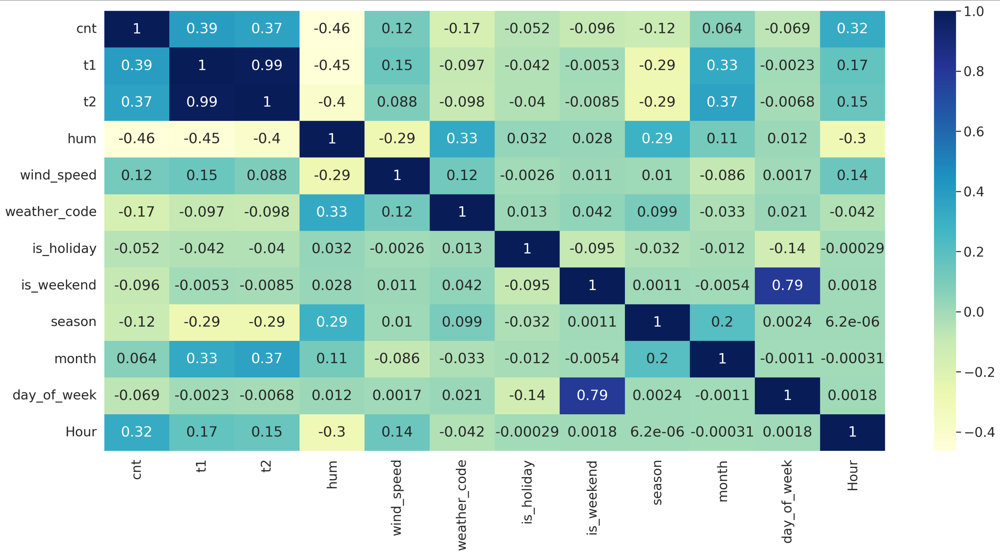
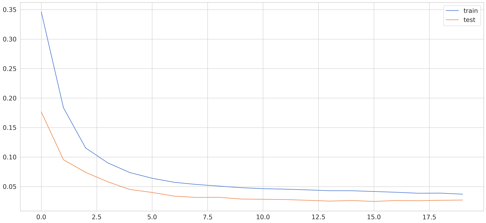
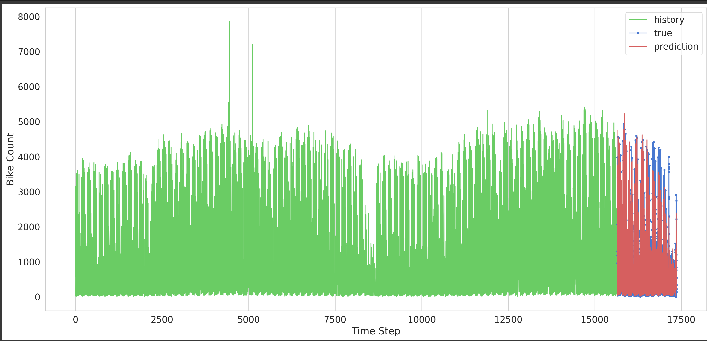

# Bike-Rental-Demand-Forecast---BiLSTM

## Overview
This project involves the use of a bi-directional Long Short-Term Memory (biLSTM) model to forecast demand. The model is designed to capture complex patterns in time series data, making it well-suited for predicting future demand based on historical observations.

## Getting Started
To use this notebook, you will need to download the required dataset from Kaggle. Follow the instructions in the notebook to obtain the API command for downloading the dataset.

## Requirements
- Python 3.x
- Jupyter Notebook or JupyterLab or Googlecolab
- Necessary Python packages as listed in the notebook (e.g., TensorFlow, NumPy, Pandas)

## How to Use
1. Ensure you have Jupyter Notebook or JupyterLab installed.
2. Install the required Python packages.
3. Download the dataset from Kaggle and place it in the appropriate directory.
4. Open the `biLSTM_Demand_Forecast.ipynb` notebook and follow the instructions.

## Summary of the project
1.  EDA  

 
3.  Feature Transformation
4.  Building LSTM architecture
5.  Fitting and validating the model using train and validation data.
 
6.  Testing the model performance on out of time Test dataset.

.png "Actual vs Predicted") 

## Conclusions
1.  The model was able to predict consitently across train, validation, test suggesting good generalization
2.  After testing different architectures, a simpler model with a 32 unit layer performed better than 64 or 128 units on test data
3.  The model performance drops the farther we look into the future owing to uncertaining around external factors, business growth etc.
4.  The model is still very good predictor of demand for next 1-2 months. So model refresh cycle could be fitted according to this.
5.  Additional features such as supply, #stockouts  etc. could give a better indication of true demand vs realized demand which could lead to better stocking.

